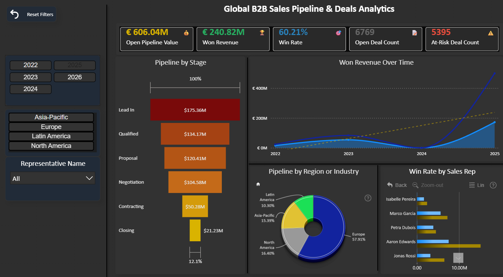

# 📊 FP20 Analytics Challenge 35 — Global B2B Sales Pipeline & Deals Analytics

> **Power BI report built for FP20 Analytics Challenge 35**, in collaboration with ZoomCharts.  
> Analysing enterprise B2B sales pipeline health, rep performance, and revenue trends across global regions.



---

## 🏆 Challenge

**FP20 Analytics Challenge 35** | Organised by [Federico Pastor](https://www.linkedin.com/in/federico-pastor/) & the FP20 Analytics Community  
**Dataset:** Enterprise Sales Pipeline — 11,750 deals · 117,500 activities · 1,000 companies · 55 sales reps  
**Submission Deadline:** March 10, 2026

---

## 📌 Report Overview

The report is designed as a **daily decision-making resource** for Sales Managers, giving them a real-time view of pipeline health, team performance, and revenue momentum — all from a single page.

### Page 1 — Executive Overview

| Section | Visuals |
|---|---|
| **KPI Row** | Open Pipeline Value · Won Revenue · Win Rate · Open Deal Count · At-Risk Deal Count |
| **Pipeline by Stage** | Line Chart with Drill Down |
| **Won Revenue Over Time** | ZoomCharts Drill Down Timeline PRO — drill from Year → Quarter → Month |
| **Pipeline by Region or Industry** | ZoomCharts Drill Down Pie PRO — regional breakdown with drill to Region and Industry |
| **Win Rate by Sales Rep** | ZoomCharts Drill Down Combo Bar PRO (Filter) — rep performance with cross-filtering |

### Key Questions Answered

- How do pipeline value and deal volume change over time?
- At what stages do deals slow down or get stuck?
- Which sales reps consistently manage the healthiest pipelines?
- Which open deals are at high risk due to lack of activity?
- Which regions and industries contribute most to revenue?

---

## 🗂️ Data Model

```
FactDeals        ──── DimCompany    (CompanyID)
FactDeals        ──── DimSalesRep   (RepID)
FactDeals        ──── DimDate       (CreatedDateKey)     ← Active
FactDeals        ──── DimDate       (LastActivityDateKey) ← Inactive
FactActivities   ──── FactDeals     (DealID)
FactActivities   ──── DimDate       (ActivityDateKey)
FactActivities   ──── DimSalesRep   (RepID)              ← Inactive
```

---

## 🧮 Key DAX Measures

<details>
<summary>Click to expand — Core Measures</summary>

```dax
Open Pipeline Value =
    CALCULATE (
        SUM ( FactDeals[DealValueEUR] ),
        FactDeals[Status] = "Open"
    )

Won Revenue =
    CALCULATE (
        SUM ( FactDeals[DealValueEUR] ),
        FactDeals[Status] = "Won"
    )

Win Rate =
    VAR _closed =
        CALCULATE (
            COUNTROWS ( FactDeals ),
            FactDeals[Status] IN { "Won", "Lost" }
        )
    RETURN
        DIVIDE ( [Won Deal Count], _closed, 0 )

At-Risk Deal Count =
    VAR _today = TODAY ()
    VAR _threshold = 30
    RETURN
    CALCULATE (
        COUNTROWS ( FactDeals ),
        FactDeals[Status] = "Open",
        FILTER (
            FactDeals,
            VAR _lastAct =
                LOOKUPVALUE (
                    DimDate[Date],
                    DimDate[DateKey], FactDeals[LastActivityDateKey]
                )
            RETURN
                DATEDIFF ( _lastAct, _today, DAY ) > _threshold
        )
    )

Weighted Pipeline Value =
    CALCULATE (
        SUMX (
            FactDeals,
            FactDeals[DealValueEUR] * FactDeals[BaseWinProbability]
        ),
        FactDeals[Status] = "Open"
    )
```

</details>

A full reference of all DAX measures used in this report is available in [`DAX_Measures.md`](DAX_Measures.md).

---

## 🎨 Design Decisions

- **Dark theme** (`#1A1A2E` base) for reduced eye strain in daily use
- **Heat gradient funnel** (red → orange → gold) to communicate deal urgency at each stage
- **Color-coded KPI cards** — green for positive outcomes, red for risk signals
- **ZoomCharts drill-down visuals** for seamless cross-filtering and time-period exploration without page navigation
- **Emoji icon overlays** on KPI cards for instant visual scanning

---

## 🔌 ZoomCharts Visuals Used

| Visual | Used For |
|---|---|
| Drill Down Combo Bar Pro |  Win Rate by Sales Rep |
| Drill Down Donut Pro | Pipeline by Region |


---

## 🚀 How to Use

### Option A — Open the Template (.pbit)
1. Download `FP20_Challenge35.pbit`
2. Open in Power BI Desktop
3. Connect to the provided dataset (`Enterprise_Sales_Pipeline_Challenge_35.xlsx`)
4. Refresh data

### Option B — Open the Report (.pbix)
1. Download `FP20_Challenge35.pbix`
2. Open directly in Power BI Desktop — data is already embedded

> **Requirement:** Power BI Desktop (free) — [Download here](https://powerbi.microsoft.com/desktop)

---

## 📁 Repository Structure

```
├── FP20_Challenge35.pbit        # Power BI template (no data)
├── FP20_Challenge35.pbix        # Full report with embedded data
├── README.md                    # This file
├── DAX_Measures.md              # Full DAX measures reference
└── preview.png                  # Dashboard screenshot
```

---

## 🙋 Author

**Abraham Cyrman Jiménez**  
[LinkedIn](https://www.linkedin.com/in/abraham-cyrmanj/) 

*Participating in FP20 Analytics Challenge 35*  
`#FP20Analytics` `#FP20EnterpriseDataGovernance` `#builtwithzoomcharts`

---

## 📄 License

Dataset provided by FP20 Analytics for challenge purposes.  
Report design and DAX measures © Abraham Cyrman Jiménez 2026.